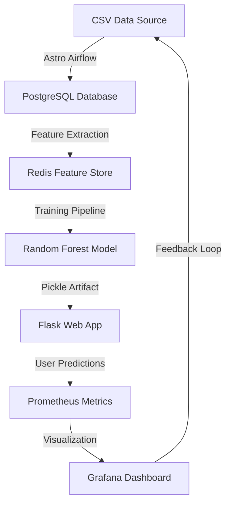
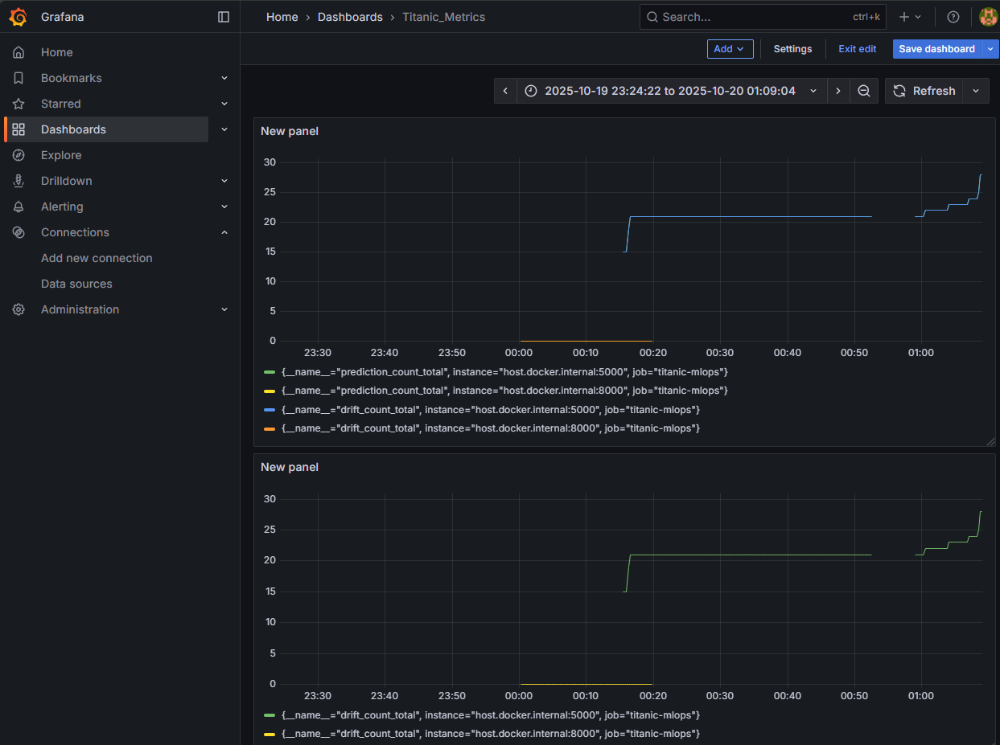

# 🚢 Titanic MLOps — End-to-End Machine Learning Pipeline

An end-to-end **MLOps implementation** of the classic Titanic survival prediction problem — reimagined as a **production-grade machine learning system**.  
This project emphasizes **data orchestration, feature storage, model training, deployment, and observability**, built with **open-source tools** to simulate a real-world MLOps workflow.

---

## 🧠 Overview

Instead of focusing solely on model accuracy, this project highlights the **MLOps architecture** required to automate and monitor the entire lifecycle of a machine learning solution — from **data ingestion to model deployment**.

The goal is to demonstrate how traditional ML projects evolve into **scalable, monitored, and automated ML systems** using modern DevOps and data engineering tools.

---

## ⚙️ Architecture



---

## 🧩 Key Components

### 1. **Data Layer**
- **🗂 Data Ingestion:**  
  - Managed with **Astro Airflow**, orchestrating automated CSV ingestion into **PostgreSQL**.
  - Uses **MinIO** (S3-compatible storage) to simulate AWS S3 buckets — enabling cloud-like behavior while **reducing operational costs**.
- **🔎 Data Processing:**  
  - Implements feature engineering pipelines (age bins, family size, cabin flags, etc.) using a **modular class structure** in `data_processing.py`.
  - Ensures data consistency, validation, and version tracking.

### 2. **Feature Store**
- Powered by **Redis**, allowing **low-latency access** to processed data during model training and serving.  
- Acts as a bridge between data ingestion and model training pipelines.

### 3. **Model Pipeline**
- Built using **object-oriented design**:
  - `data_ingestion.py`
  - `data_processing.py`
  - `model_trainer.py`
- Each class includes a **custom logger** and **exception handler** for robustness and traceability.  
- **Training:** Random Forest Classifier with **Randomized Search Cross-Validation** for hyperparameter tuning.  
- **Evaluation:** Based on model **accuracy**, with trained models exported as `.pkl` artifacts for deployment.

### 4. **Web Application**
- Developed with **Flask** (backend) and **HTML + Tailwind CSS** (frontend).  
- Designed to provide a smooth and interactive **user interface** for prediction requests.
- The web UI extracts and computes derived fields (e.g., FamilySize, HasCabin, Title, Age_Fare ratio) on the server side.

🖼 Example Interface:


---

### 5. **Monitoring & Observability**
- Integrated **Prometheus** for metrics collection and **Grafana** for real-time visualization.
- Tracks:
  - **Prediction counts**
  - **Data drift metrics**
  - **Model usage and system health**

🖼 Example Monitoring Dashboard:



---

## 📦 Project Structure

```
TITANIC-MLOPS/
│
├── dags/                     # Airflow DAGs for data pipelines
├── pipeline/                 # Modular pipeline scripts
│
├── src/                      # Core application code
├── templates/                # Web UI (HTML templates)
│   └── index.html
├── static/                   # CSS & assets (Tailwind)
│
├── application.py             # Flask backend app
├── prometheus.yml             # Prometheus configuration
├── Dockerfile                 # Container setup
├── docker-compose.yml         # Orchestrates all services
├── requirements.txt           # Dependencies
└── README.md
```

---

## 🧰 Tech Stack

| Layer | Technology |
|-------|-------------|
| **Data Orchestration** | Astro Airflow |
| **Storage** | PostgreSQL, MinIO (S3 Simulation) |
| **Feature Store** | Redis |
| **Model Training** | scikit-learn, Random Forest, RandomizedSearchCV |
| **Web Backend** | Flask |
| **Frontend** | HTML + Tailwind CSS |
| **Monitoring** | Prometheus + Grafana |
| **Containerization** | Docker & Docker Compose |
| **Logging & Exceptions** | Custom Logger & Exception Classes |

---

## 🚀 Run Locally

1. **Clone this repo**
   ```bash
   git clone https://github.com/DanielEXT10/titanic-mlops.git
   cd titanic-mlops
   ```

2. **Start containers**
   ```bash
   docker-compose up --build
   ```

3. **Access services**
   - Flask app → `http://localhost:5000`
   - Airflow UI → `http://localhost:8080`
   - Grafana → `http://localhost:3000`
   - Prometheus → `http://localhost:9090`
   - MinIO Console → `http://localhost:9001`

---

## 📈 Results

- **Model Accuracy:** ~82%  
- **End-to-End Automation:** Achieved via Airflow DAGs and Redis feature store  
- **Cost Optimization:** MinIO used as local S3 emulator  
- **Real-time Monitoring:** Enabled with Prometheus & Grafana


## 🧩 Future Improvements

- Integrate **MLflow** for experiment tracking  
- Deploy Flask app with **Gunicorn + Nginx**  
- Add automated data drift detection and retraining  
- CI/CD integration with **GitHub Actions**

---

## ✨ Author

**Daniel Alfonso García Pérez**  
AI & MLOps Engineer | Data Enthusiast | Automation Innovator  
📍 Guadalajara, Mexico 

---

## 🛠 License

This project is licensed under the **MIT License**.

---

> _“Turning a simple model into a production-grade machine learning system — that’s where MLOps begins.”_
